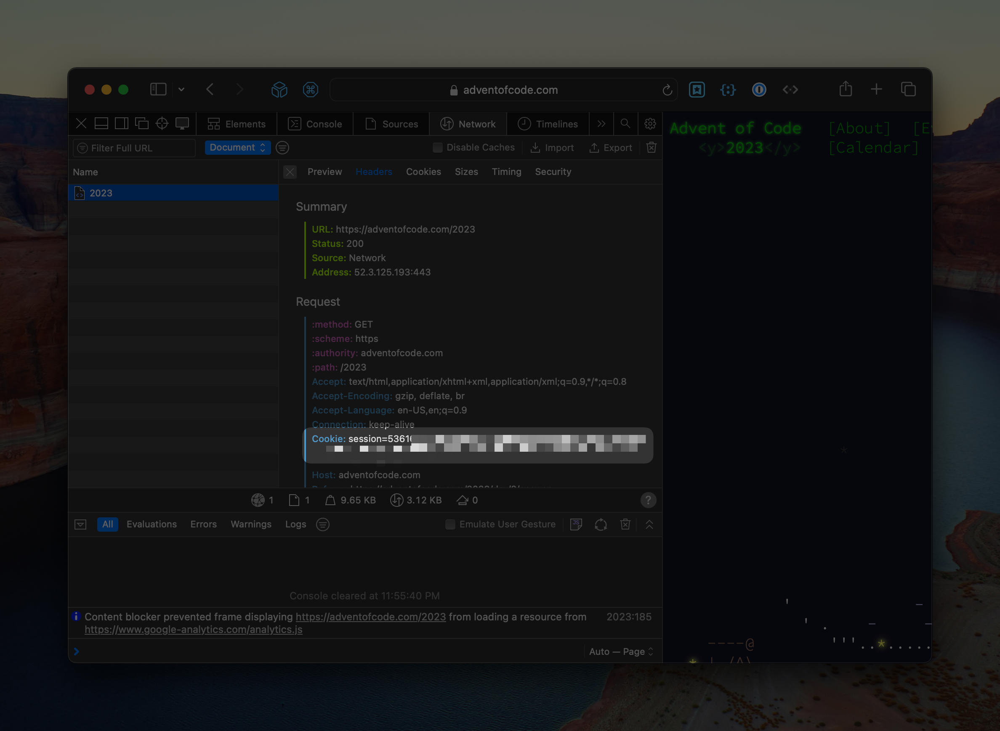

# Advent of Code 2023

## Solutions

The solution to each day can be found in the [days](./days) folder. :warning:**WARNING**:warning:: That folder contains spoilers.

## Set up

### Step 1: Install dependencies

```
npm install
```

### Step 2: Set your `session` cookie value

If you aren't sure how to find the session cookie, open up https://adventofcode.com/2023 and make sure you're logged in. Then open up the developer tools and change to the Network tab and refresh the page. Look for the `2023` entry and find a line that looks like:

```
Cookie: session=awholebunchoflettersandnumbers
```

It'll look something like this:


Copy the value (everything after the `session=` bit), and then create a new file called `.env` in the same folder as this `README` file. Assign that cookie value to a variable called `AOC_SESSION`. When you're done, it should look something like this:

```
AOC_SESSION=awholebunchoflettersandnumbers
```

Doing this will automatically download your version of the day's input file when you run the script.

## Running a script

You can run any script with this command

```
npx ts-node --esm -r dotenv/config days/$DAY/$PART.mts
```

where `$DAY` is `01`, `02`, etc.
and `$PART` is `part1` or `part2`
